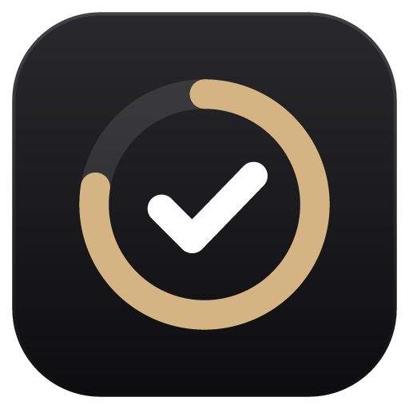
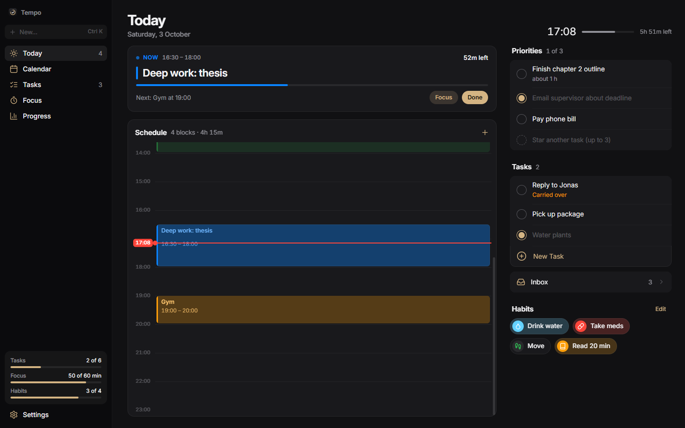
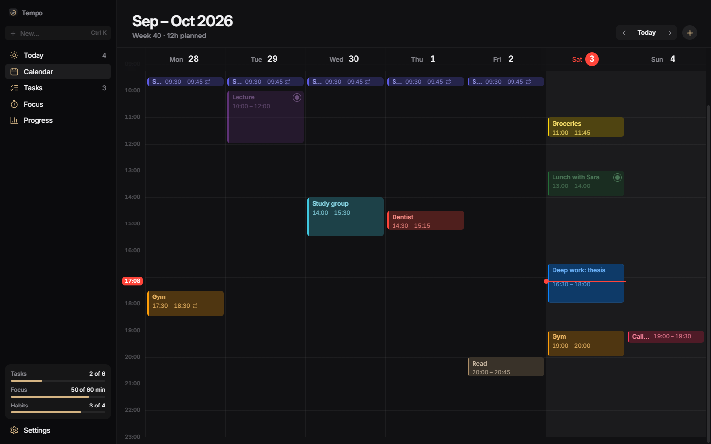
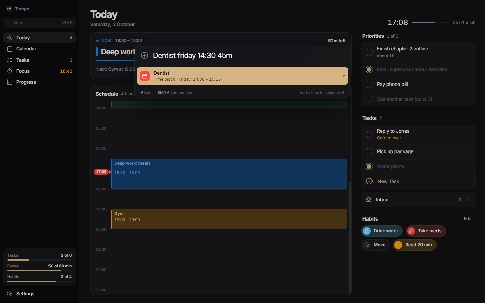
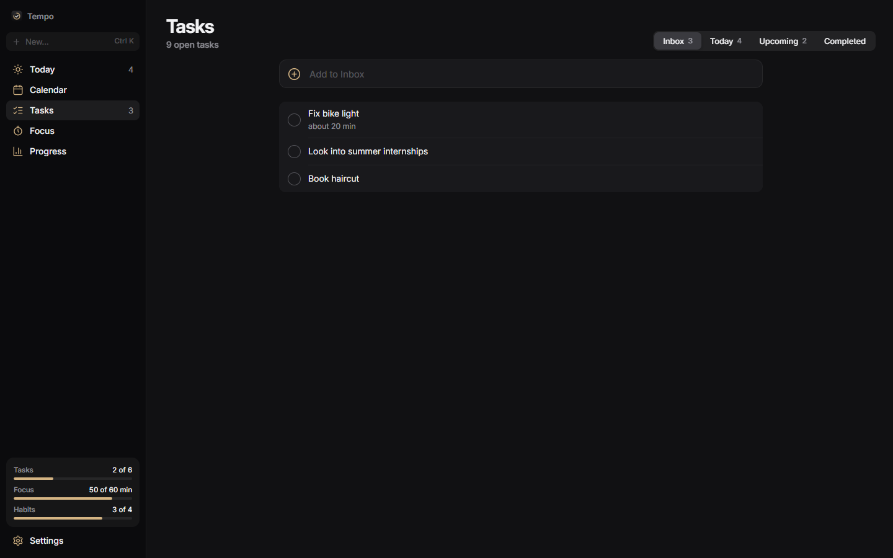
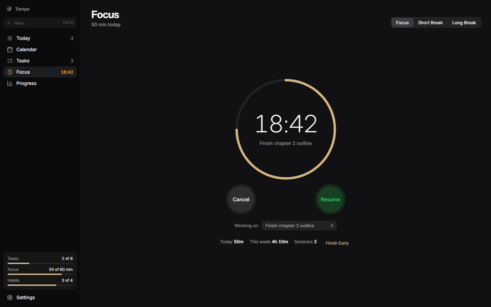
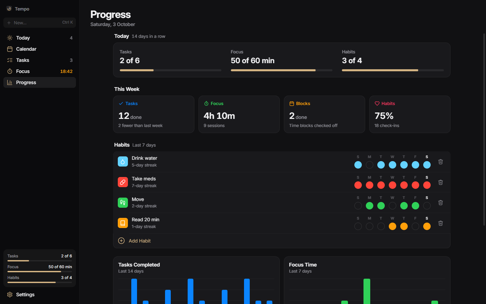
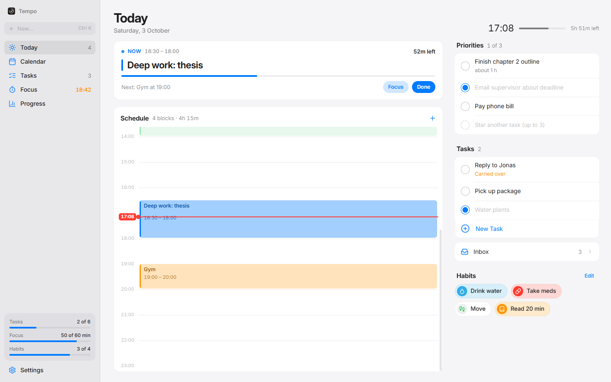

<div align="center">



# Tempo

**A calm, focused day planner for Windows.**<br>
Time blocks, three daily priorities, a focus timer and habit tracking — in one quiet, keyboard-friendly app.

[](https://github.com/welovevyxzl/Tempo/releases/latest)


<br>



</div>

<br>

## Why Tempo

Most planners ask you to manage the planner. Tempo is built for busy, easily-distracted brains: it keeps **what's happening now** and **what's next** in front of you, limits you to **three priorities**, and nudges you *before* a block starts and *before* it ends — so switching tasks stops being a surprise.

- **Always know where you are.** A live “Now” card shows the current block, time remaining and what comes next.
- **Fewer decisions.** Star up to three tasks. That's the day. Everything else is optional.
- **Capture in two seconds.** Press <kbd>Ctrl</kbd> <kbd>Shift</kbd> <kbd>Space</kbd> from any app and type *“Dentist friday 14:30 45m”*.
- **Gentle accountability.** Habits, focus time and completed tasks add up on a simple progress page.

<br>

## Features

<table>
<tr>
<td width="50%" valign="top">

### Calendar
Drag on the grid to create a block, drag a block to move it, drag its edge to resize. Blocks can repeat daily, on weekdays or weekly, and be ticked off when done.

</td>
<td width="50%"></td>
</tr>
<tr>
<td width="50%"></td>
<td width="50%" valign="top">

### Quick add
Natural-language input that understands dates, times and durations, with a live preview of what will be created. Add a time and it becomes a block; leave it out and it becomes a task.

</td>
</tr>
<tr>
<td width="50%" valign="top">

### Tasks
An inbox for brain-dumping, plus Today, Upcoming and Completed lists. Push anything to tomorrow in one click, rename inline, undo every delete.

</td>
<td width="50%"></td>
</tr>
<tr>
<td width="50%"></td>
<td width="50%" valign="top">

### Focus
A focus/break timer that shows its progress in the Windows taskbar, logs sessions against a task, and keeps running in the background.

</td>
</tr>
<tr>
<td width="50%" valign="top">

### Progress
Today's tasks, focus minutes and habits at a glance, weekly stats, habit streaks, charts and a six-month activity map.

</td>
<td width="50%"></td>
</tr>
</table>

**Also:** reminders before blocks start and end · runs quietly in the tray · optional start with Windows · dark, light or automatic theme · accent colours · reduced-motion mode · JSON export/import.

<div align="center"><br><sub>Light theme</sub></div>

<br>

## Install

1. Download **`Tempo-Setup-x.y.z.exe`** from the [latest release](https://github.com/welovevyxzl/Tempo/releases/latest) (or the portable `.exe` if you'd rather not install).
2. Run it. Tempo installs per-user — no admin rights needed — and adds Start menu and desktop shortcuts.

> [!NOTE]
> The installer isn't code-signed, so Windows SmartScreen may show *“Windows protected your PC”*. Click **More info → Run anyway**.

## Keyboard shortcuts

| Shortcut | Action |
| --- | --- |
| <kbd>Ctrl</kbd> <kbd>K</kbd> or <kbd>N</kbd> | New task or block |
| <kbd>Ctrl</kbd> <kbd>Shift</kbd> <kbd>Space</kbd> | Quick add from **any** app |
| <kbd>Shift</kbd> <kbd>Enter</kbd> | Add and keep the quick-add bar open |
| <kbd>1</kbd> – <kbd>5</kbd> | Today · Calendar · Tasks · Focus · Progress |
| <kbd>Space</kbd> | Start / pause the focus timer |
| <kbd>←</kbd> <kbd>→</kbd> <kbd>T</kbd> | Previous week · next week · this week |
| Double-click a task | Rename it |
| <kbd>Esc</kbd> | Close sheets and popovers |

## Quick-add syntax

| You type | You get |
| --- | --- |
| `Pay rent` | Task in the Inbox |
| `Call mom friday` | Task due Friday |
| `Read 20 min` | Task with a 20-minute estimate |
| `Gym tomorrow 18:00 1h` | Block tomorrow, 18:00 – 19:00 |
| `Deep work 9-11` | Block today, 09:00 – 11:00 |
| `Lunch with Sara at 1pm` | Block today at 13:00 (1 h by default) |
| `Report next monday at 9:15 for 1h30` | Block next Monday, 09:15 – 10:45 |
| `Doctor 12/10 10:00` | Block on 12 October at 10:00 |

Dates: `today`, `tonight`, `tomorrow`, weekday names, `next <day>`, `in 3 days`, `dd/mm`. Times: `14:30`, `14.30`, `2pm`, `at 9`, `noon`. Durations: `45m`, `1h`, `1.5h`, `1h30`, `for 90 min`.

## Privacy

Tempo has no account, no server and no analytics. Everything is stored in a single JSON file on your PC:

```
%APPDATA%\Tempo\tempo-data.json
```

A backup of the previous state is kept next to it each time the app starts, and you can export or import your data from **Settings**.

## Build from source

Requires [Node.js](https://nodejs.org) 18 or newer.

```bash
git clone https://github.com/welovevyxzl/Tempo.git
cd Tempo
npm install
npm start          # run in development
npm run dist       # build the installer + portable .exe into dist/
```

Other scripts:

```bash
npm run icon                                   # regenerate build/icon.png + icon.ico
node tools/dev-server.js                       # preview the UI in a browser on :5179
node_modules/.bin/electron tools/screenshots.js  # re-render the README screenshots
```

### Project structure

```
main.js            Electron main process — window, tray, notifications, storage, global shortcut
preload.js         The small, explicit bridge between the UI and the main process
renderer/
  index.html       App shell
  styles.css       Design tokens, light/dark themes, components
  app.js           Views, quick-add parser, calendar drag & drop, focus timer, reminders
  fonts/           Inter (SIL Open Font License)
build/             App icon
tools/             Icon generator, dev server, screenshot renderer
docs/              README screenshots
```

The UI is plain HTML, CSS and JavaScript — no framework and no runtime dependencies.

## Credits

- Typeface: [Inter](https://rsms.me/inter/) by Rasmus Andersson, under the SIL Open Font License.
- Icons adapted from [Lucide](https://lucide.dev), under the ISC License.

## License

[MIT](LICENSE) © 2026 Adian
